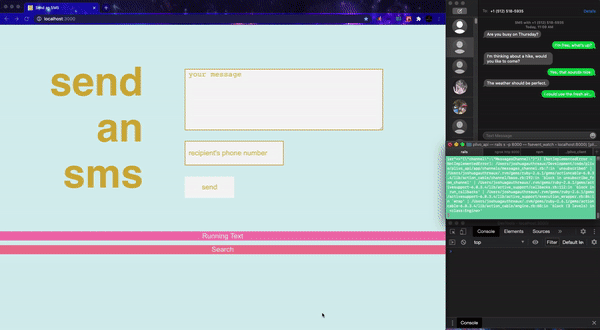

# Send an SMS -- API
___
Welcome! 

Follow these instructions to setup the back-end for this app. 
Once completed, find the instructions for the front-end [here](https://github.com/Josh-Gotro/Plivo_client).

___
## Preview


___
## Features
- Send and Recieve texts using the Plivo Messaging API
- Receive Texts in real-time using webhooks and disply to the client
- View historical logs of incoming & outgoing messages via user-selceted date/time using Plivo API
___
## Dependancies
*If you don't have these installed, follow the links to find instructions and prerequisites for each.* 
 - [Rails](https://guides.rubyonrails.org/getting_started.html#creating-a-new-rails-project-installing-rails)
 - [Ngrok](https://ngrok.com/download) 
___
## Setup

### Plivo
*Sign up for Plivo*
- Navigate to [Plivo](https://console.plivo.com/accounts/register/) and follow the instructions to sign up. 
- Navigate to the [Console](https://console.plivo.com/dashboard/). Bookmark this tab and note the Auth ID and Auth Token, you will need these later. 

*Rent a phone number*
- Navigate [here](https://console.plivo.com/phone-numbers/search/?). 
- Select "SMS" option under "Capability".

- Click "Search"
- Choose a phone number by clicking "Buy Number" on the right.
- Confirm the purchase on the pop-up.

*Create a Plivo application*

- Navigate to [Add New Application](https://console.plivo.com/sms/applications/add/?). Note the Application Name, or enter your own. 
- Click "Create Application". 

*Connect phone number to application*
- Navigate to [Your Numbers](https://console.plivo.com/active-phone-numbers/) and click your number. 
- Under "Application Type", select "XML Application".
- Under "Plivo Application", select your application. 
- Click "Update Number"
- Search [Applications](https://console.plivo.com/sms/applications/) for your application and click it. 
- Bookmark this page for future use. 
***
### Download and Configure this app
 *Install app and start server*
- Clone this repository and navigate into the directory. 
- Run the following four commands from your terminal:
```
bundle
```
```
rails db:create 
```
```
rails db:migrate
```
```
rails s -p 8000
```
*Configure Secret Credential to access Plivo API*
- In a new terminal, run the following:
```
EDITOR="vim --wait" bin/rails credentials:edit
```
*(If you prefer to use and editor other than Vim, replace "vim" with the editor of your choice. Note, some people reported issues saving the file with other editors)*
- Vim editor will open a file where you will enter your Plivo credentials. Enter the following into this file, replacing <auth_id> and <auth_token> with the information listed in your [Plivo Console](https://console.plivo.com/dashboard/).
```
plivo:
auth_id: <auth_id>
auth_token: <auth_token>
```
- Press ":wq" tp save and quit Vim. 
- Confirm in the terminal that it has saved correctly. 
```
New credentials encrypted and saved. It should say the following:
```
***
### Ngrok
*Start ngrok tunneling*
- Run the following from the terminal (be sure you are in the project directory)
```
ngrok http 8000
```
- A new ngrok session will open. 
- Copy the url labled "Forwarding". You may choose either the http or https.

*Enter url into your Plivo App*
- Navigate to your bookmarked Plivo Application or search for it [here](https://console.plivo.com/sms/applications/) and click on it.
- Scroll down to the "Message" section and make sure "Post" is selected from the drop-down. 
- Paste the ngrok url under "Message URL"
- Click "Update Application"
***
***
***Congrats! You have the back-end set up. Now head over [here](https://github.com/Josh-Gotro/Plivo_client) to install the front-end***
***
***


# About
## Technologies Used in This Project
**Plivo Messaging API**
- Send Text
- Recieve Text in Real Time
- Retrieve Records by Date-range

**Rails 6**
- JSON API 
- Action Cable Web Sockets
- Encrypted Secrets 

**Ngrok**
- Expose Localhost Server to the Internet
- Use Ngrok to Set Webhooks That Talk to Plivo Server
___
## Contact Me


[Email](joshuagauthreaux@gmail.com)

[LinkedIn](https://www.linkedin.com/in/josh-gauthreaux/)

[Portfolio](https://www.joshgotro.com)

[Medium](https://medium.com/@joshuagauthreaux)


